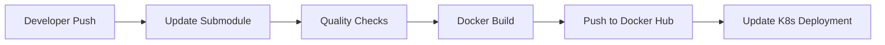

# 🎯 DevOps Final Project - Face Detection App Deployment

> A complete DevOps pipeline for deploying a Next.js face detection application using modern DevOps practices and tools.

## 🚀 Application Overview

This project includes a custom-built Next.js application ([next-face-detection-app](https://github.com/DanorSODA/next-face-detection-app)) as a submodule, which:

- 📸 Implements real-time face detection using webcam stream
- ⚡ Built with Next.js and TypeScript
- 🧠 Uses face-api models for detecting face landmarks, age, gender and emotion
- 🐳 Containerized using Docker
- 🔄 Automatically updated through CI/CD pipeline

### ✨ Application Features

- 🎥 Live video stream processing
- 👤 Real-time face detection
- 📱 Responsive web interface
- 🚀 Optimized Docker container

### Docker Implementation

- Multi-stage build process
- Optimized image size
- Configured for both development and production
- Automated builds via GitHub Actions

## 🔄 Project Flow

### 1. 🏗️ Infrastructure Deployment

💡 Infrastructure Details

The infrastructure is provisioned using Terraform, which creates all necessary AWS resources including VPC, subnets, EC2 instances for Kubernetes nodes, and security groups. Once complete, a fully functional Kubernetes cluster is ready for deployments.

### 2. 👨‍💻 Development Flow

💡 Development Details

When developers push changes, it triggers an automated pipeline that runs quality checks, builds a new Docker image, and updates the Kubernetes deployment with zero downtime.

### 3. 🏛️ Infrastructure Overview

💡 Infrastructure Overview Details

The project runs on AWS with separate environments for production and staging, each with its own Kubernetes cluster. Production runs with higher availability using 3 pod replicas, while staging uses 2 replicas for cost efficiency.

## 🛠️ Prerequisites

- ☁️ AWS Account with appropriate permissions
- 🐳 Docker installed
- ⚓ kubectl installed
- 🏗️ Terraform installed
- 🔧 AWS CLI configured

## 🏗️ Technical Architecture

### 🔄 CI/CD Pipeline with GitHub Actions

1. **📦 Submodule Update Workflow**

   - Automatically detects changes in the next-face-detection-app
   - Updates the submodule in this repository
   - Triggers the quality checks pipeline

2. **✅ Quality Checks & Docker Build**

   - Runs after submodule updates
   - Performs TypeScript, ESLint, and formatting checks
   - Builds and pushes Docker image to Docker Hub

3. **🚀 Continuous Deployment**
   - Triggered by Docker Hub webhooks
   - Connects to Kubernetes cluster using GitHub Secrets
   - Updates the application deployment with zero downtime

### ⚓ Kubernetes Resources

1. **🔍 Namespace**

   - Named 'face-detection'
   - Provides logical separation of workloads

2. **🚀 Deployment**

   - Manages application pods
   - Handles rolling updates
   - Controls replica count and resource allocation

3. **🔌 Service**

   - Exposes the application within the cluster
   - Manages internal load balancing
   - Routes traffic to application pods

4. **🌐 Ingress**
   - Handles external access to the service
   - Manages SSL/TLS termination
   - Configures routing rules

### 🔐 Security

- 🛡️ AWS security groups for network isolation
- 🔑 SSH key authentication for server access
- 🔒 GitHub Secrets for sensitive data
- 🔐 HTTPS enforcement for web traffic

### 🌍 Environments

1. **🏭 Production**

   - High availability setup
   - Multiple worker nodes
   - Production-grade resources

2. **🧪 Staging**
   - Testing environment
   - Reduced resource allocation
   - Development validation

## 📚 Additional Information

- 📖 [Installation Guide](install.md)
- 👥 [Contributors](CONTRIBUTORS.md)
- ✅ [Tasks](TASKS.md)
